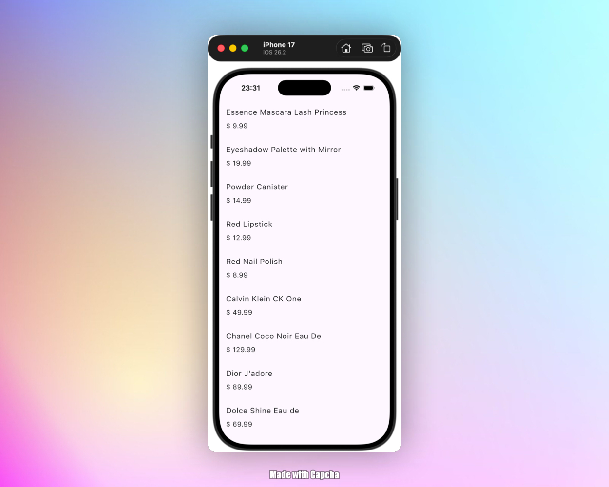
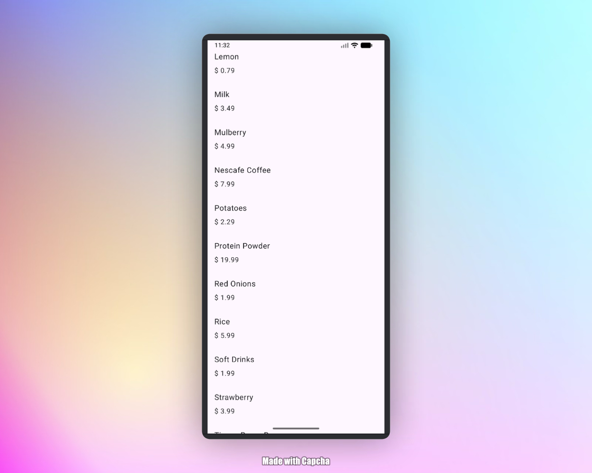

# AppKmpPaginator 🚀

Este projeto é um estudo focado na implementação de **Paginação (Endless Scrolling)** em **Kotlin Multiplatform (KMP)**. O objetivo principal é demonstrar como gerenciar o estado de carregamento e a busca incremental de dados de forma eficiente e compartilhada entre Android e iOS.

## Preview

<div>


<div>

## 🎯 Objetivo do Projeto

Estudar e aplicar os conceitos de paginação dinâmica, utilizando uma arquitetura robusta que separa a lógica de negócio da interface do usuário, garantindo uma experiência fluida de carregamento infinito.

## 🛠️ Tecnologias Utilizadas

- **[Kotlin Multiplatform (KMP)](https://kotlinlang.org/docs/multiplatform.html)**: Compartilhamento de lógica de negócio entre plataformas.
- **[Compose Multiplatform](https://www.jetbrains.com/lp/compose-multiplatform/)**: UI declarativa para Android e iOS.
- **[Ktor](https://ktor.io/)**: Cliente HTTP para chamadas de rede assíncronas.
- **[Kotlinx Coroutines](https://kotlinlang.org/docs/coroutines-overview.html)**: Gerenciamento de tarefas em background e fluxos assíncronos.
- **[Kotlinx Serialization](https://kotlinlang.org/docs/serialization.html)**: Conversão de JSON para objetos Kotlin.
- **[AndroidX Lifecycle ViewModel](https://developer.android.com/topic/libraries/architecture/viewmodel)**: Gerenciamento de estado de UI orientado ao ciclo de vida.

## Stack

<table>
  <tr>
    <td align="center" width="120" height="120">
      
      <br><strong>Kotlin</strong><br>Multiplatform
    </td>
    <td align="center" width="120" height="120">
      
      <br><strong>Compose</strong><br>Multiplatform
    </td>
  </tr>
</table>

## 🏗️ Padrões de Projeto e Arquitetura

O projeto segue os princípios da **Clean Architecture** e o padrão **MVVM (Model-View-ViewModel)**:

- **MVVM**: Separação clara entre os dados (`Model`), a lógica de exibição (`ViewModel`) e a interface (`View`).
- **Generic Paginator**: Uma classe genérica (`Paginator.kt`) que encapsula toda a lógica de controle de chaves, estados de erro, sucesso e carregamento, permitindo reutilização para diferentes tipos de dados.
- **Repository/Service Pattern**: Uso de serviços (`ProductsApi`) para abstrair a comunicação com a API externa.
- **Observer Pattern**: Utilização de `StateFlow` e `snapshotFlow` para reagir a mudanças no estado da lista e disparar novos carregamentos.

## 📦 Dependências Principais

As versões estão centralizadas no arquivo `libs.versions.toml`:

| Dependência           | Versão   |
| :-------------------- | :------- |
| Kotlin                | `2.3.0`  |
| Compose Multiplatform | `1.10.0` |
| Ktor                  | `3.2.1`  |
| Coroutines            | `1.10.2` |
| Serialization         | `2.3.0`  |
| Android Gradle Plugin | `8.11.2` |

## ⚙️ Configuração e Execução

### Pré-requisitos

- **Android Studio** (versão Ladybug ou superior recomendada).
- **Xcode** (para rodar no iOS).
- **Kotlin Multiplatform Wizard** plugins instalados.

### Como rodar

1. **Clone o repositório**:
   ```bash
   git clone <url-do-repositorio>
   ```
2. **Abra no Android Studio**.
3. **Android**: Selecione a configuração `composeApp` e execute no emulador ou dispositivo físico.
4. **iOS**:
   - Abra o terminal na pasta raiz e execute `./gradlew :composeApp:embedAndSignAppleFrameworkForXcode`.
   - Alternativamente, abra a pasta `iosApp` no Xcode e execute.

## 📝 Detalhes da Implementação

A lógica central reside no `Paginator<Key, Item>`, que recebe lambdas para:

- `onRequest`: Realizar a chamada de rede.
- `getNextKey`: Calcular a próxima chave (ou página).
- `onSuccess` / `onError`: Lidar com os resultados.
- `endReached`: Determinar quando não há mais itens para carregar.

A interface utiliza o `snapshotFlow` do Compose para monitorar o índice do último item visível na `LazyColumn`, disparando o `loadNextItems()` automaticamente quando o usuário se aproxima do fim da lista.
